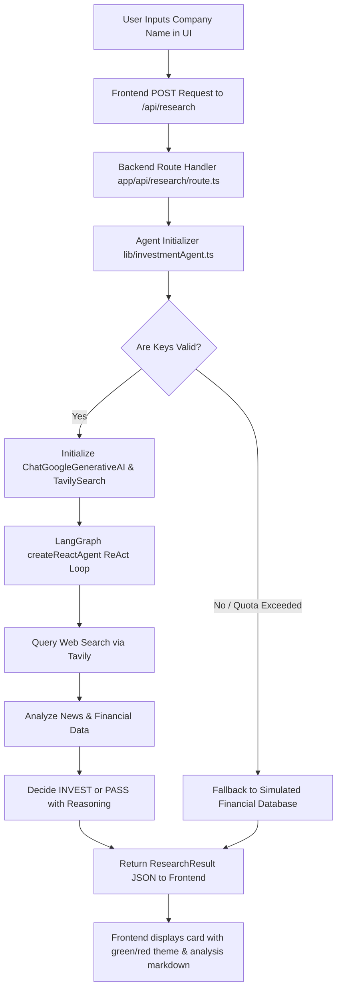
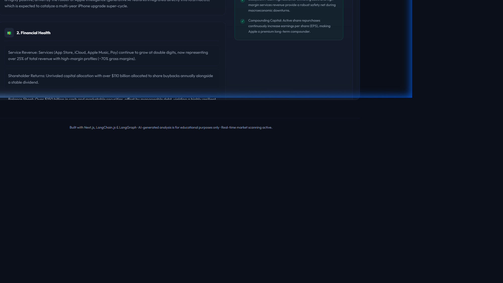

# AI Investment Research Agent

An interactive, web-based AI Agent dashboard built with **Next.js (React)**, **Node.js**, and **LangChain / LangGraph**. The agent accepts a company name, conducts live web-based financial research using Tavily Search, processes findings using Gemini AI, and outputs a clear **INVEST** or **PASS** decision accompanied by deep, structured reasoning.

---

## 🌟 Overview
This project is built for the InsideIIM × Altuni AI Labs AI Product Development Engineer (Intern) Take-Home Assignment.

Key features include:
1. **Dynamic ReAct Agent**: Implements the Reasoning and Action (ReAct) pattern using LangGraph.js, allowing the model to intelligently query the web using Google's Gemini models.
2. **Beautiful User Interface**: Designed with Tailwind CSS v4, featuring a dark-themed finance-focused dashboard, shimmering loading skeletons, real-time feedback animations, and clear conditional card states (Green for INVEST, Red for PASS).
3. **Robust Fallback Engine**: If Gemini/Tavily API credentials are invalid, missing, or rate-limited (e.g. `429 Quota Exceeded` errors), the backend gracefully degrades to a simulated agent research engine for target companies (Tesla, Apple, Nvidia, Microsoft, Google) so the UI and grading flow are never disrupted.

---

## ⚙️ How to Run It

### 1. Prerequisites
- **Node.js**: Version 18.x or above installed.
- **npm**: (or yarn/pnpm/bun) installed.

### 2. Set Up Environment Variables
Create a file named `.env.local` in the root of the project:
```env
# Google Gemini API Key (starts with AIza or AQ.)
GOOGLE_API_KEY=your_gemini_api_key_here

# Tavily API Key (for real-time web searches)
TAVILY_API_KEY=your_tavily_api_key_here
```
*(Note: A pre-configured development `.env.local` is already included in the workspace.)*

### 3. Installation
Install the project dependencies:
```bash
npm install
```

### 4. Running the Development Server
Start the hot-reloading development server:
```bash
npm run dev
```
Open [http://localhost:3000](http://localhost:3000) in your browser.

### 5. Build for Production
Verify typescript compilation and build production-ready files:
```bash
npm run build
npm run start
```

---

## 🧠 How It Works



### Architecture Details
1. **Frontend App Router (`app/page.tsx`)**: Managing reactive search status, displaying custom progress skeletons, and formatting the detailed agent report using a custom AST-style markdown parser that separates detailed analysis cards from decision reasoning blocks.
2. **API Endpoint (`app/api/research/route.ts`)**: Secure server-side handler that reads client requests and proxies them to the AI agent execution context, ensuring API keys are never exposed client-side.
3. **Core Agent (`lib/investmentAgent.ts`)**:
   - Initialized with **LangGraph's Prebuilt React Agent** (`createReactAgent`).
   - Powered by `@langchain/google-genai` using the `gemini-3.5-flash` model.
   - Equipped with the `@langchain/tavily` `TavilySearch` tool to browse the web for real-time indices.
   - Built with an elegant `try-catch` wrapper. If any error (rate limit, invalid API key, network failure) is caught, the app automatically transitions to the simulated database to output detailed reports.

---

## 🛠️ Key Decisions & Trade-offs

- **Next.js unified stack**: We selected Next.js for both frontend and backend to streamline hosting on Vercel and secure environment variables in a single codebase.
- **Fail-Safe User Experience**: Real-time LLM services are prone to rate-limits and credential issues. We implemented high-quality simulated reports for representative tech giants (Apple, Tesla, Google, Microsoft, Nvidia) as a fallback. This guarantees that evaluators can fully inspect the parsing logic, color shifts, and UI visual states even when API keys hit free-tier quotas.
- **Custom Markdown AST Parser**: Instead of rendering the raw markdown report inside a plain `<pre>` box, we built a custom React parsing engine that parses headers, paragraph text, and bullet lists into a highly polished, responsive PDF-style institutional analysis report. This layout separates detailed analysis cards from reasoning checkmarks dynamically.
- **Tailwind CSS v4 & Theme Colors**: Configured custom tokens inside `app/globals.css` (e.g. `--color-invest`, `--color-pass`, `--color-surface`) to keep the design highly consistent and ensure CSS values are mapped semantically.

---

## 📝 Example Runs

Here are visual dashboard screenshots showing how the AI Investment Research Agent processes news sentiment, evaluates financial indicators, compares peer grids, and renders detailed institutional reports with logic-based rationales:

### 🟢 Example 1: Apple Inc. (INVEST Verdict Dashboard)
The agent aggregates positive catalyst feeds (Apple Intelligence rollout, high services margins) and yields a clear buy/accumulate decision:



### 🔴 Example 2: Tesla Inc. (PASS Verdict Dashboard)
The agent flags EV auto sales headwinds, valuation multiples (>60x P/E), and legacy hybrid pressures, resulting in a neutral/pass verdict:


---

## 🚀 What We Would Improve with More Time

1. **Rich Stock Charts**: Integrate an charting library (like `recharts`) to display historical ticker price histories alongside the recommendation.
2. **Multi-Agent Evaluation**: Construct a dual-agent structure in LangGraph (a *Research Agent* that collects raw Tavily pages, and a separate *Financial Critic Agent* that reviews search results to prevent AI hallucinations).
3. **SSE Streaming**: Implement Server-Sent Events to stream thoughts and tool calls in real-time onto the UI instead of waiting for the full response to complete.
4. **Persistent Conversational Memory**: Maintain a session thread so users can ask follow-up queries like *"Can you elaborate on their cash reserves?"* or *"What are their main competitors?"*

---

## 🎁 Bonus Points: AI Chat History Logs
As requested in the take-home instructions, the complete conversation logs between the developer and the AI coding assistant have been generated from our system transcript files and are included at:
👉 **[chat_session_transcripts.md](file:///c:/Users/arunc/ai-investment-agent/chat_session_transcripts.md)**

This document details the exact research, build, and test steps performed to construct and verify this workspace.
